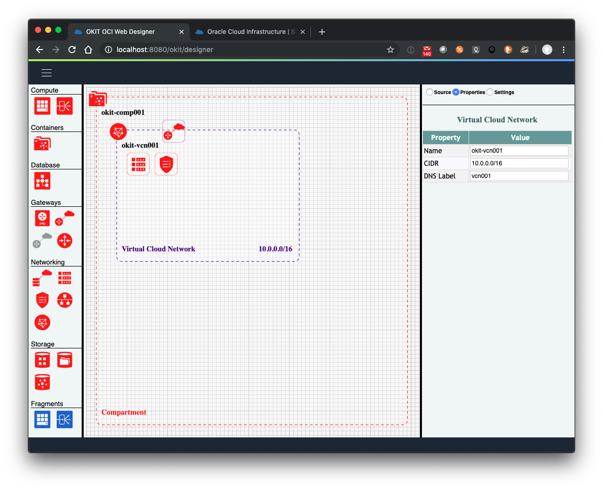
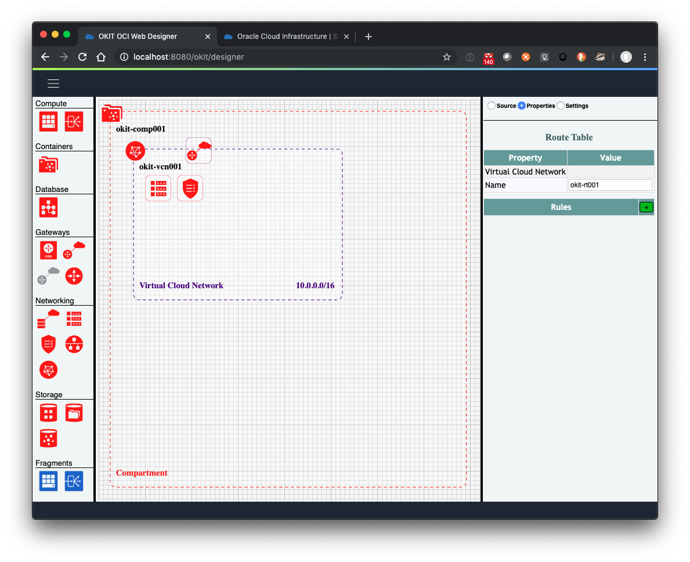
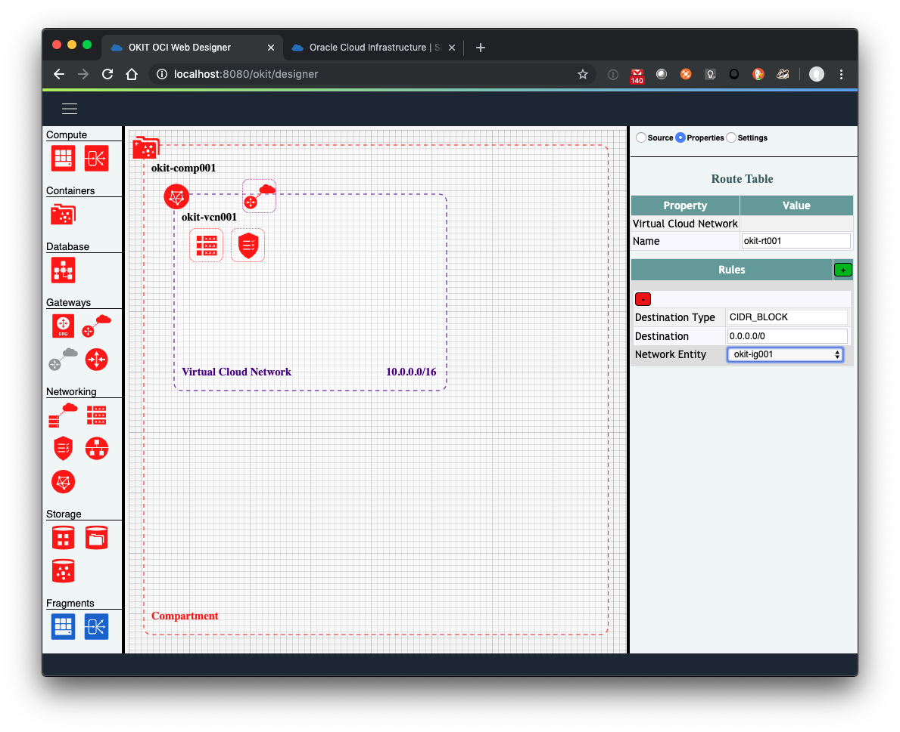
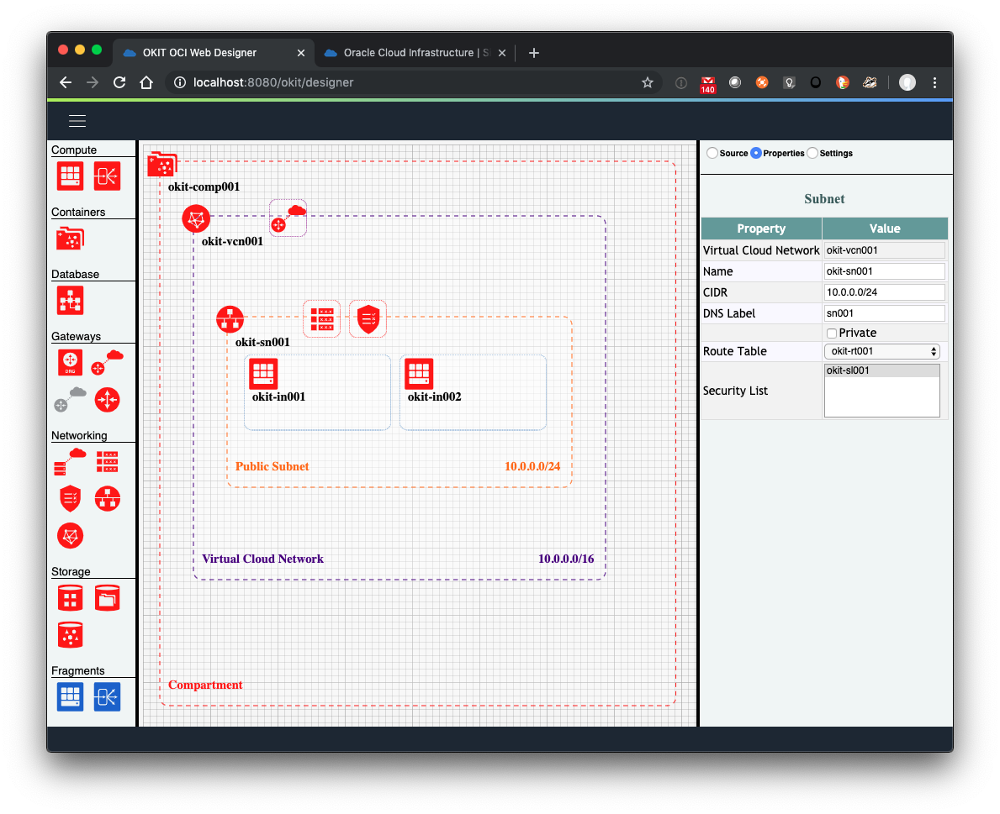
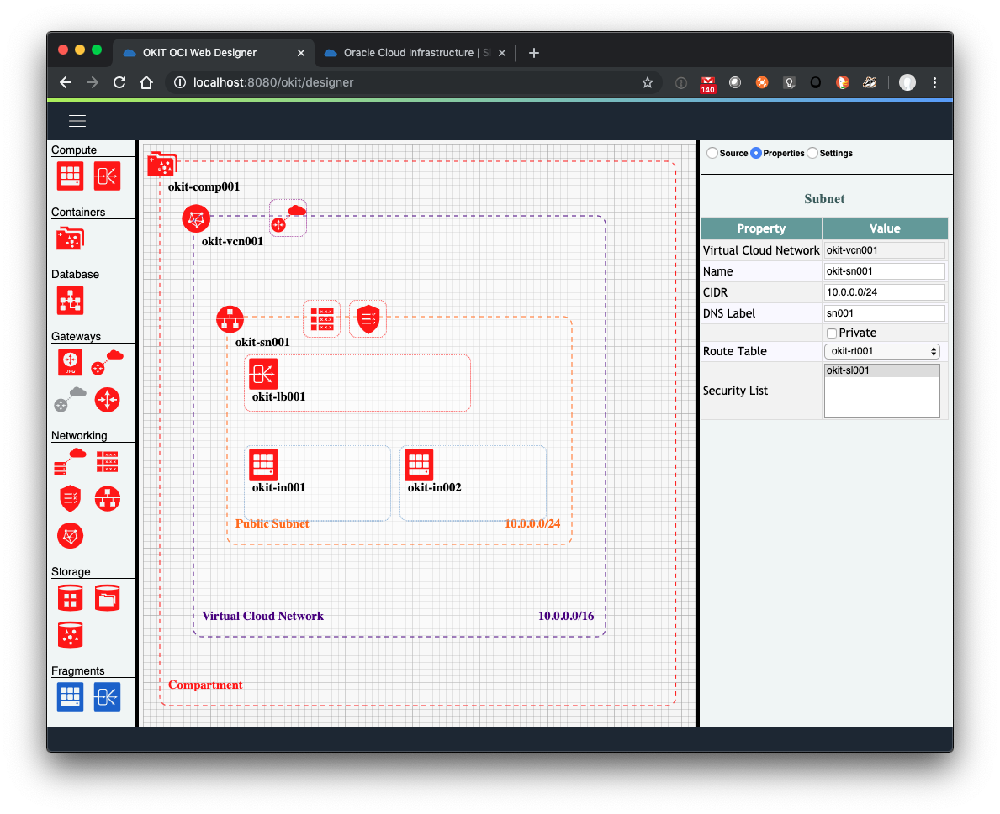
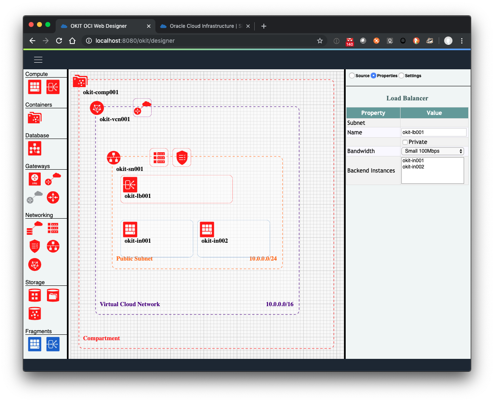
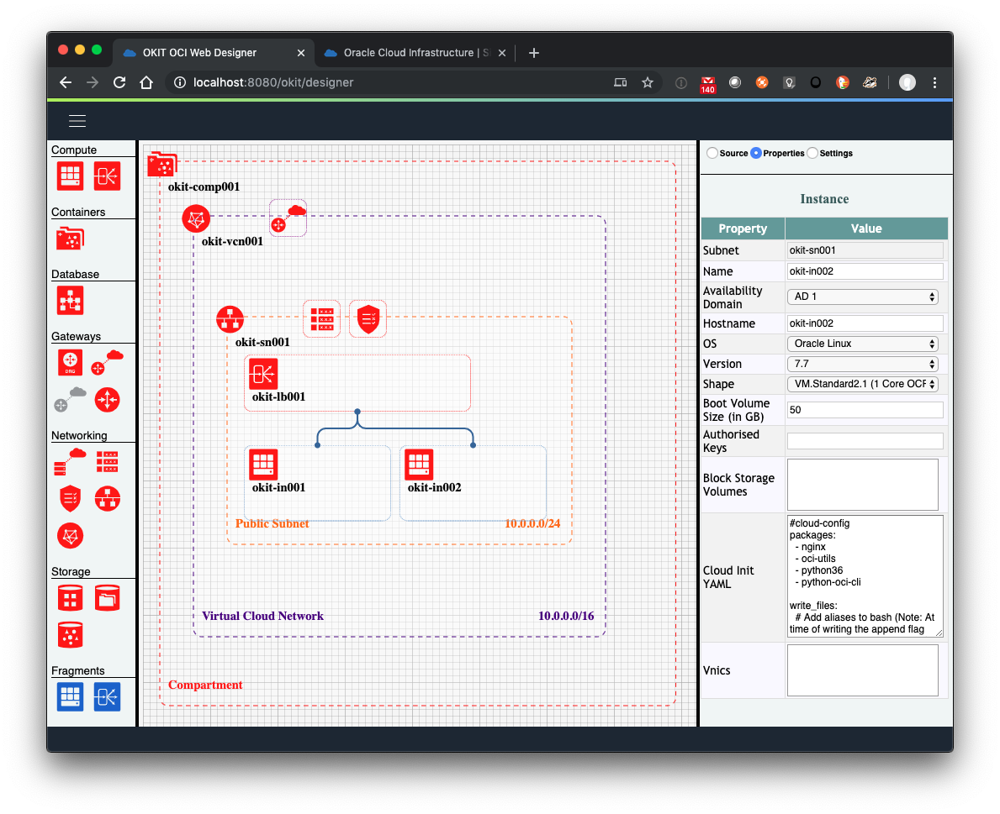

# OCI Kinetic Infrastructure Toolkit

OCI Kinetic Infrastructure Toolkit (OKIT) is a a series of tools that allow the user to Query, Capture, Visualise and
Generate DevOps tooling scripts. Using the toolkit the DevOps user will be able to capture existing OCI environments,
through simple command line or web based interface, and then convert them to standard DevOps languages (see below). 
The web based drawing toll can also be used to generate simple architectural representations of customer systems that 
can quickly be turned into code and ultimately built in the OCI environment.

## Table of Contents

1. [Installation](#installation)
2. [Usage](#usage)
    1. [Currently Implemented Artifacts](#currently-implemented-artifacts)
    2. [Prerequisites](#prerequisites)
    3. [Web Interface](#web-interface)
    4. [Command Line](#command-line)
3. [Examples](#examples)
4. [Contributing](#contributing)
5. [Development](#development)
6. [3rd Party Libraries](#3rd-party-libraries)


## Installation
Although OKIT can simply be downloaded and the command line executed it is recommended that it be executed within a
docker container that can be built using the Dockerfile within this repository. This will guarantee that all the required 
python modules are installed and in addition provide a simple flask server that will present the web based application on
[http://localhost:8080/okit/designer](http://localhost:8080/okit/designer).

Therefore these installation instructions will describe the docker based implementation.

##### 1. Clone Repository
**Note**: To clone the OraHub Repository you will need to be on the Corporate Network.
```bash
anhopki-mac:tmp anhopki$ git clone git@orahub.oraclecorp.com:andrew.hopkinson/okit.oci.web.designer.git

Cloning into 'okit.oci.web.designer'...
===============================================================================
            Oracle USA Inc. - Unauthorized Access Strictly Prohibited
-------------------------------------------------------------------------------
   WARNING: This is a restricted access server. If you do not have explicit
            permission to access this server, please disconnect immediately.
            Unauthorized access to this system is considered gross misconduct
            and may result in disciplinary action, including revocation of
            access privileges, immediate termination of employment.
===============================================================================
remote: Enumerating objects: 448, done.
remote: Counting objects: 100% (448/448), done.
remote: Compressing objects: 100% (208/208), done.
remote: Total 1455 (delta 287), reused 376 (delta 229)00 KiB/s
Receiving objects: 100% (1455/1455), 604.46 KiB | 798.00 KiB/s, done.
Resolving deltas: 100% (859/859), done.
```
##### 2. Change Directory into docker directory
```bash
anhopki-mac:tmp anhopki$ cd okit.oci.web.designer/docker/
anhopki-mac:docker anhopki$ lh

total 56
0 drwxr-xr-x  10 anhopki  staff   320B 15 Aug 10:08 .
0 drwxr-xr-x   9 anhopki  staff   288B 15 Aug 10:08 ..
8 -rwxr-xr-x   1 anhopki  staff   932B 15 Aug 10:08 build-docker-image.sh
8 -rwxr-xr-x   1 anhopki  staff   238B 15 Aug 10:08 connect-flask-bash-shell.sh
8 -rwxr-xr-x   1 anhopki  staff   241B 15 Aug 10:08 connect-gunicorn-bash-shell.sh
0 drwxr-xr-x   3 anhopki  staff    96B 15 Aug 10:08 docker
8 -rwxr-xr-x   1 anhopki  staff   1.6K 15 Aug 10:08 docker-env.sh
8 -rwxr-xr-x   1 anhopki  staff   512B 15 Aug 10:08 start-bash-shell.sh
8 -rwxr-xr-x   1 anhopki  staff   621B 15 Aug 10:08 start-flask.sh
8 -rwxr-xr-x   1 anhopki  staff   654B 15 Aug 10:08 start-gunicorn.sh
```
##### 3. Execute Build Script
**Note**: For this to work correctly you will need to be **off** the Corporate Network.
```bash
anhopki-mac:docker anhopki$ ./build-docker-image.sh
```


## Usage
### Supported Browsers
At present not all browsers are fully supported the following is a list of supported browsers and status.
- Supported
   - Chrome
   - Brave
   - Chromium Based Browsers
   - Firefox 
- Partially Supported
   - Safari
- Unsupported
   - IE
### Currently Implemented Artifacts
In the present release the following OCI artifacts have been implemented. The information captured in the properties may 
only be the minimum to create the artifacts but will be extended in the future.

- Virtual Cloud Network 
- Internet Gateway
- Route Table
- Security List
- Subnet
- Instance
- Load Balancer
- Vnics
- Autonomous Database
- Block Storage Volumes
- Object Storage Buckets

### Prerequisites
Before executing any of the docker container scripts we OKIT requires that a OCI connection configuration file be created.
This file will contain the following:

```properties
[DEFAULT]
user=ocid1.user.oc1..aaaaaaaak6z......
fingerprint=3b:7e:37:ec:a0:86:1....
key_file=~/.oci/oci_api_key.pem
tenancy=ocid1.tenancy.oc1..aaaaaaaawpqblfem........
region=us-phoenix-1

```
You will then need to create the following environment variable that points to the directory containing the config file.

```bash
export OCI_CONFIG_DIR=~/.oci/oci.config
```

### Web Interface
To use the Web Application you will first need to start the docker container and run either flask or gunicorn which can 
be achieved by running either of the following scripts, that can be found in the docker sub-directory.

```bash
anhopki-mac:docker anhopki$ ./start-flask.sh

DOCKERIMAGE = development/orahub/andrew.hopkinson/okit.oci.web.designer
/okit
HOSTNAME=start-flask
TERM=xterm
ANSIBLE_INVENTORY=/okit/ansible/config/ansible_hosts
LC_ALL=en_GB.UTF-8
FLASK_APP=okitweb
PYTHONIOENCODING=utf8
http_proxy=
ftp_proxy=
ANSIBLE_LIBRARY=:
PATH=/root/bin:/usr/local/sbin:/usr/local/bin:/usr/sbin:/usr/bin:/sbin:/bin
PWD=/okit
LANG=en_GB.UTF-8
FLASK_DEBUG=development
https_proxy=
SHLVL=1
HOME=/root
LANGUAGE=en_GB:en
no_proxy=*
ANSIBLE_CONFIG_DIR=/okit/ansible/config
PYTHONPATH=:/okit/visualiser:/okit/okitweb:/okit
ANSIBLE_CONFIG=/okit/ansible/config/ansible.cfg
_=/usr/bin/env
 * Serving Flask app "okitweb" (lazy loading)
 * Environment: production
   WARNING: This is a development server. Do not use it in a production deployment.
   Use a production WSGI server instead.
 * Debug mode: on
 * Running on http://0.0.0.0:8080/ (Press CTRL+C to quit)
 * Restarting with stat
```

```bash
anhopki-mac:docker anhopki$ ./start-gunicorn.sh

DOCKERIMAGE = development/orahub/andrew.hopkinson/okit.oci.web.designer
/okit/okitweb
HOSTNAME=start-gunicorn
TERM=xterm
ANSIBLE_INVENTORY=/okit/ansible/config/ansible_hosts
LC_ALL=en_GB.UTF-8
FLASK_APP=okitweb
PYTHONIOENCODING=utf8
http_proxy=
ftp_proxy=
ANSIBLE_LIBRARY=:
PATH=/root/bin:/usr/local/sbin:/usr/local/bin:/usr/sbin:/usr/bin:/sbin:/bin
PWD=/okit/okitweb
LANG=en_GB.UTF-8
FLASK_DEBUG=development
https_proxy=
SHLVL=1
HOME=/root
LANGUAGE=en_GB:en
no_proxy=*
ANSIBLE_CONFIG_DIR=/okit/ansible/config
PYTHONPATH=:/okit/visualiser:/okit/okitweb:/okit
ANSIBLE_CONFIG=/okit/ansible/config/ansible.cfg
_=/usr/bin/env
[2019-08-15 14:32:05 +0000] [7] [INFO] Starting gunicorn 19.9.0
[2019-08-15 14:32:05 +0000] [7] [INFO] Listening at: http://0.0.0.0:8080 (7)
[2019-08-15 14:32:05 +0000] [7] [INFO] Using worker: sync
[2019-08-15 14:32:05 +0000] [10] [INFO] Booting worker with pid: 10
[2019-08-15 14:32:05 +0000] [11] [INFO] Booting worker with pid: 11
```
#### Designer BUI
The Designer BUI can be accessed on [http://localhost:8080/okit/designer](http://localhost:8080/okit/designer) and consists of 3 main areas.
1. Palette
2. Canvas
3. Properties Sheet

The palette should all currently available assets and they can be dragged from the palette on the canvas below. During the 
drag process the icon will indicate if the palette icon can be dropped on the underlying component. If appropriate a "+" 
sign will be displayed. Once the icon has been dropped the appropriate properties sheet will be displayed for the new asset.

If assets (e.g. subnet) are dropped within a containing asset (e.g. virtual cloud network) then it will be associated with the 
containing asset. Alternatively assets may be linked using connectors which can be dragged from the asset to associate
(e.g. route table) to the associated asset (e.g. subnet). Again the drop is only appropriate on certain components and 
the web front end will restrict this.

A simple diagram representing a virtual Cloud Network with associated Internet Gateway, Route Table, Security List and 
Instances fronted by a Load Balancer can be seen below.


The hamburger menu in the top left will display a slide out menu with all available actions (described below).

##### Palette
- Compute
    -       Instance
    -  Load Balancer
- Containers
    -  Compartment
    -    Container (OKE)
- Database
    -  Autonomous Database
- Gateways
    -  Dynamic Routing Gateway
    -         Internet Gateway
    -              NAT Gateway
    -          Service Gateway
- Networking
    -           Fast Connect
    -            Route Table
    -          Security List
    -                 Subnet
    -  Virtual Cloud Network
- Storage
    -   Block Storage Volume
    -    File Storage System
    -  Object Storage Bucket

##### Menu 


- Canvas
    - New
    - Load
    - Save
    - Redraw
- Templates
- Query
    - OCI
- Generate
    - Terraform
    - Ansible
- Export
    - SVG
    - Resource Manager

###### Canvas/New
Creates a new clear canvas.
###### Canvas/Load
Allows the user to select a previously saved or command line generated json file.
###### Canvas/Save
Saves the current diagram as a json representation.
###### Canvas/Redraw
Redraws the existing canvas this will have the effect of grouping similar assets.
###### Templates
This is a dynamic menu that represents the available templates that can be loaded as a starting point for system development.
##### Query/OCI
Opens Query pages and populates the Compartment list. Once the user has chosen the compartment and added a virtual cloud network 
filter submitting will query OCI and draw the returning assets on the new designer canvas.
##### Generate/Terraform
Generate a set of Terraform that can be used to build the designed OCI infrastructure currently loaded and return as a zip file.
##### Generate/Ansible
Generate a set of Ansible that can be used to build the designed OCI infrastructure currently loaded  and return as a zip file.
###### Export/SVG
Will export the current diagram as an SVG object that can be distributed.
###### Export/Resource Manager
Will generate Terraform code and export the resulting zip file into the OCI Resource Manager. Once uploaded it will initiate
a plan job.

### Command Line
To use the Command Line you will first need to start the docker container using the following script:
```bash
anhopki-mac:docker anhopki$ ./start-bash-shell.sh
DOCKERIMAGE = development/orahub/andrew.hopkinson/okit.oci.web.designer
[root@start-bash-shell workspace]#
```
Alternatively if you are running the Webb Application you can connect to the existing docker contain using either:

- connect-flask-bash-shell.sh
- connect-gunicorn-bash-shell.sh

The command line interface consists of a number of python programs as follows:
#### Capture
**(WIP)** The capture python will connect to the specified OCI instance (defaults to config in users home directory) and 
queries OCI based on the specified filters. The resulting data is then written to the specified OKIT json file (okit.json)
and can be subsequently imported into the web based interface or used to generate the DevOps files (see [Generate](#generate)).
#### Validate
**(WIP)** The validate python will read the specified OKIT json file (okit.json) and check if the references are consistent.
#### Generate
The generate python process takes a specified OKIT json file (okit.json) and converts it to a number terraform or ansible 
files that can then be used with the appropriate DevOps tooling to build the artifacts defined within the json file.
```bash
# Generate Terraform
python3 generate.py -f okit.json -d destination_directory -t

# Generate Ansible
python3 generate.py -f okit.json -d destination_directory -a

# Generate Terraform & Ansible
python3 generate.py -f okit.json -d destination_directory -t -a
```
#### Generate TF from OCI
This test program will connect to OCI with the default configuration and query based on the specified filter (-c) then generate
appropriate yerraform files below the specified directory.
```bash
cd test/unit.test
python3 ./generateTFfromOCI.py -d . -c Stefan
```


## Examples
The following short tutorial will take you through a worked example for creating a simple 2 Instance load balanced nginx
implementation. The results of the worked example can be seen in the template (Simple Load Balancer).

This worked example will take you step-by-step through the process of building a visual representation of our application 
and then ultimately generate Ansible 7 Terraform scripts that can be executed to build the solution. The Designer BUI is 
built using simple HTML / JavaScript and provides an intuative Drag & Drop interface for placing artifacts on the canvas.
Appropriate drop locations for an Artifact will be indicated by the addition of a green ***"+"*** over the Drag Icon.

### Step 1 : Open OKIT Designer
The first step to building a diagram is be to open the designer page. If you have the docker container running (executed {Project Root}/docker/start-nginx.sh)
this will be located at [http://localhost:8080/okit/designer](http://localhost:8080/okit/designer) and will bring up a new
empty diagram that contains only a top level Compartment. It can be seen that the Designer is split into 3 main panels.
- Left (Palette): Contains all Drag Artifacts that can be used within the Designer. In addition this panel contains a fragments section which contain pre built common solution fragments, e.g. Bastion Host.
- Centre (Canvas): Area on which the diagram will be built / displayed.
- Right (Properties): Dynamically updated / changed panel that will show the editable properties associated with the selected Artifact.

The Compartment name can be edited by simply clicking on it and modifying the name in the displayed properties. Although 
we can change the name it is for display purposes only because this Compartment will not be created just it's contents.

### Step 2 : Add Virtual Cloud Network
The first this we will need for our Load Balancer example is to create a Virtual Cloud Network and this can be achieved 
by dragging the Virtual Cloud Network Icon  
from the palette onto the compartment. Doing this will create a Simple Virtual Cloud Network and populate it with a default
Route Table and Security List. Again if the names do not match you requirements select the Artifact and edit in the properties panel.
Looking at the Properties you will notice that a number of default values have been assigned including the CIDR which will
be 10.0.0.0/16, If a second Virtual Cloud Network is added its CIDR will be 10.1.0.0/16 thus keeping them unique.

These can be removed by Right-Clicking on them and selecting Delete but we will not do this because they are appropriate
in this example. The generation of these is optional and configured in the settings window (see radio buttons at top of properties panel).

### Step 3 : Add Internet Gateway
To allow access to our system we will need an Internet Gateway added to the Virtual Cloud Network. We will do this in the 
same way we did for the Virtual Cloud Network but selecting the Internet Gateway Icon 
from the palette and dragging it over the Virtual Cloud Network. You should note whilst doing this how the drag Icon changes
to indicate allowable drop targets.

### Step 4 : Select Route Table
The auto generated Route Table will need to be modified to add a Route Rule to direct traffic to the Internet Gateway. Select
the Route Table  on the Canvas and its
properties will appear in the properties Panel. Click the Green ***"+"*** button on the rules table and a new Rule will be created.

Within the new Rule we will specify the Destination (CIDR Block) and the appropriate Gateway (Network Entity).

### Step 5 : Add Subnet
We will now add a Subnet to our diagram by selecting the Subnet Icon 
from the Palette and dragging it over the Virtual Cloud Network. Dropping this will create place a Subnet on our Virtual Cloude Network
with a CIDR based on its parent (10.0.0.0/24) Additional Subnet will increment the 3rd Octet. 

### Step 6 : Connect Subnet to Route Table & Security List
To allow Artifacts within the network to access / be accessed by the internet we will need to provide it with a Route Table 
and Security List. We can achieve this by selecting the Subnet and editing the properties to select the existing Route Table abd Security List.
Once this has been done you will notice that the Route Table Icon 
and Security List Icon  have moved to the 
top edge of the Subnet to indicate that the Subnet has assigned Route Table and Security. Additional Subnet can also select the same 
Route Table and Security List.

### Step 7 : Add Instances
We will now create 2 Instances within the Subnet by dragging the Instance Icon 
from the Palette and dropping it on the Subnet. You will notice that the second Instance will have the designation "002" 
rather than "001".

### Step 8 : Add load Balancer
Next well will create a Load Balancer by dragging the Load Balancer Icon 
from the Palette onto the Subnet. You will notice that Instances move and this is because the Visualiser controls placement 
and will dynamically move / resize components to best display the system.

### Step 9 : Connect Load Balancer to Instances
Now we will need to connect the Load Balancer to the 2 backend Instance and we will do this by selecting the Load Balancer 
and in the displayed Properties panel selecting the 2 Instances displayed in the "Backend Instance" Select box. On doing this
you note that Load Balancer and the Instances become connected in the diagram.


### Step 10 : Update Instance Properties
Our final step will be to update each of the instances to provide an Authorised Key for the instance and a Cloud Init YAML
to install and configure nginx. We will do this by selecting each Instance individually and editing the properties and using 
the [Cloud Init YANL](#cloud-init-yaml) below. Once this has been done our diagram is now complete and can be saved using the 
"Save" option below the "Hamburger" menu. 

#### Cloud Init YAML
```yaml
#cloud-config
packages:
  - nginx
  - oci-utils
  - python36
  - python-oci-cli

write_files:
  # Add aliases to bash (Note: At time of writing the append flag does not appear to be working)
  - path: /etc/.bashrc
    append: true
    content: |
      alias lh='ls -lash'
      alias lt='ls -last'
      alias env='/usr/bin/env | sort'
      alias whatsmyip='curl -X GET https://www.whatismyip.net | grep ipaddress'
  # Create nginx index.html
  - path: /usr/share/nginx/html/index1.html
    permissions: '0644'
    content: |
      <html>
      <head>
      <title>OCI Loadbalancer backend {hostname}</title>
      <meta http-equiv="Content-Type" content="text/html; charset=UTF-8" />
      <meta http-equiv="refresh" content="10" />
      <style>
      body {
      background-image: url("bg.jpg");
      background-repeat: no-repeat;
      background-size: contain;
      background-position: center;
      }
      h1 {
      text-align: center;
      width: 100%;
      }
      </style>
      </head>
      <body>
      <h1>OCI Regional Subnet Loadbalancer Backend {hostname}</h1>
      </body>
      </html>

runcmd:
  # Enable nginx
  - sudo systemctl enable nginx.service
  - sudo cp -v /usr/share/nginx/html/index1.html /usr/share/nginx/html/index.html
  - sudo sed -i "s/{hostname}/$(hostname)/g" /usr/share/nginx/html/index.html
  - sudo systemctl start nginx.service
  # Set Firewall Rules
  - sudo firewall-offline-cmd  --add-port=80/tcp
  - sudo systemctl restart firewalld
  # Add additional environment information because append does not appear to work in write_file
  - sudo bash -c "echo 'source /etc/.bashrc' >> /etc/bashrc"

final_message: "**** The system is finally up, after $UPTIME seconds ****"
```

### Terraform Generation & Execution
For the diagram you are able to select the menu option Generate->Terraform and this will generate a oci_terraform.zip 
that can be saved and extracted to produce 3 files that can be used by terraform. If we assume that the export have been
generated from the 'Load Balanced Nginx Instances' Template then the infrastructure can be created as follows.

#### Unzip Generated File
```bash
[root@start-flask terraform]# lh
total 20K
   0 drwxr-xr-x 4 root root  128 Oct 31 16:20 .
4.0K drwxr-xr-x 1 root root 4.0K Oct 28 18:00 ..
8.0K -rw-r--r-- 1 root root 6.1K Oct 31 16:20 .DS_Store
8.0K -rw-r--r-- 1 root root 5.4K Oct 31 16:20 okit-terraform.zip
[root@start-flask terraform]#
[root@start-flask terraform]# unzip okit-terraform.zip -d okit-terraform
Archive:  okit-terraform.zip
  inflating: okit-terraform/variables.tf
  inflating: okit-terraform/main.tf
  inflating: okit-terraform/terraform.tfvars
```

#### Plan Terraform Build
```bash
[root@start-flask terraform]# cd okit-terraform
[root@start-flask okit-terraform]# terraform init

..........

[root@start-flask okit-terraform]# terraform plan -var-file=/okit/config/connection.tfvars -out=da.plan
Refreshing Terraform state in-memory prior to plan...
The refreshed state will be used to calculate this plan, but will not be
persisted to local or remote state storage.
..........
```

#### Apply Terraform Plan
```bash
[root@start-flask okit-terraform]#
[root@start-flask okit-terraform]# terraform apply da.plan
oci_core_vcn.Okit-Vcn001: Creating...
oci_core_volume.Okit-Bsv001: Creating...
..........
```

### Ansible Generation & Execution
For the diagram you are able to select the menu option Generate->Ansible and this will generate a oci_ansible.zip 
that can be saved and extracted to produce 2 files that can be used by ansible. If we assume that the export have been
generated from the 'Load Balanced Nginx Instances' Template then the infrastructure can be created as follows.

#### Unzip Generated File
```bash
[root@start-flask ansible]# unzip okit-ansible.zip -d okit-ansible
Archive:  okit-ansible.zip
```

#### Run Playbook
```bash
ansible-playbook main.yml --extra-vars "@/okit/config/connection.yml" 
```


## Contributing

Bug reports, enhancement request and pull requests are welcome on the OraHub at [okit.oci.web.designer/issues](https://orahub.oraclecorp.com/andrew.hopkinson/okit.oci.web.designer/issues)


## Development
All currently active / planned development is documented / being tracked in the internal Jira ticket 
[OKIT OCI Capture / DevOps / Visualisation Tool](http://ateam-engage.us.oracle.com/jira/browse/INT-2168). 
Before starting any new development work the Jira should be checked to see if anyone else is working on the same area. 
If this is new development then a new sub task should be created to document the artifact being added.

The following worked example will take you through the required steps to add a new artifact to OKIT. This will be based 
on adding Block Storage Volumes to OKIT. Adding an artifact to OKIT will require a number files to be created and a few 
modified the following steps will document the procedure specifying where the files will need to be created and the names 
to be used.

### Adding an Artifact
The following files will need to be created and the directories specified are relative to the project root. You will notice 
that the files have a specfic naming convention and this is important because it allows the wrapper code to work with the
minimum of cross file editing / multi developer editing. As a result it greatly simplifies the addition of new artifacts 
to the system. 

- New Files
    - Frontend
        - **[Palette SVG](#palette-svg)**                             : [okitweb/static/okit/palette/*Block_Storage_Volume*.svg](okitweb/static/okit/palette/Block_Storage_Volume.svg)
        - **[Artifact Javascript](#artifact-javascript)**             : [okitweb/static/okit/js/oci_assets/*block_storage_volume*.js](okitweb/static/okit/js/oci_assets/block_storage_volume.js)
        - **[Properties HTML](#properties-html)**                     : [okitweb/templates/okit/propertysheets/*block_storage_volume*.html](okitweb/templates/okit/propertysheets/block_storage_volume.html)
    - Backend
        - **[Python OCI Facade](#python-oci-facade)**                 : [visualiser/facades/oci*BlockStorageVolume*.py](visualiser/facades/ociBlockStorageVolume.py)
        - **[Terraform Jinja2 Template](#terraform-jinja2-template)** : [visualiser/templates/terraform/*block_storage_volume*.jinja2](visualiser/templates/terraform/block_storage_volume.jinja2)
        - **[Ansible Jinja2 Template](#ansible-jinja2-template)**     : [visualiser/templates/ansible/*block_storage_volume*.jinja2](visualiser/templates/ansible/block_storage_volume.jinja2)
- Updated Files
    - Frontend
        - **[OKIT Class](#okit-class)**                               : [okitweb/static/okit/js/okit.js](okitweb/static/okit/js/okit.js)
        - **[Artifact Constants](#artifact-constants)**               : [okitweb/static/okit/js/oci_assets/artifact_constants.js](okitweb/static/okit/js/oci_assets/artifact_constants.js)
        - **[Flask Web Designer Python](#flask-web-designer-python)** : [okitweb/okitWebDesigner.py](okitweb/okitWebDesigner.py)
    - Backend
        - **[Connection Facade](#connection-facade)**                 : [visualiser/facades/ociConnection.py](visualiser/facades/ociConnection.py)
        - **[Python OCI Query](#python-oci-query)**                   : [visualiser/common/ociQuery.py](visualiser/common/ociQuery.py)
        - **[Python Generator](#python-generator)**                   : [visualiser/generators/ociGenerator.py](visualiser/generators/ociGenerator.py)

#### Naming Convention
All files associated with an artifact will have file names based on the artifact. If we take the ***Block Storage Volume***
artifact as an example it can be seen, from above, that all files are named in the same fashion with the exception of the
palette SVG file. 

All files must be named as per artifact name with the spaces replaced by underscores and converted to lowercase. The exception 
to this is the palette SVG where title case should be used instead of lower case. The reason for this is that the palette
file name will be manipulated (removing the underscore) and used to dynamically reference all Javascript function names.  

#### Palette SVG
The palette svg defines the icon that will be displayed in the Drag & Drop palette. A number of existing SVG files can be
downloaded from the confluence page [OCI Icon Set draw.io Stencils](https://confluence.oci.oraclecorp.com/pages/viewpage.action?spaceKey=~scross&title=OCI+Icon+Set+draw.io+Stencils).

One key requirement for this svg file is that all elements that draw the icon be contained within an "g" tag. The reason
for this is that the common javascript svg display routine will look for this and extract it to use as the definition for
the icon. Hence the Block Storage Volume would look like the following

```xml
<?xml version="1.0" encoding="utf-8"?>
<!-- Generator: Adobe Illustrator 21.0.0, SVG Export Plug-In . SVG Version: 6.00 Build 0)  -->
<!DOCTYPE svg PUBLIC "-//W3C//DTD SVG 1.1//EN" "http://www.w3.org/Graphics/SVG/1.1/DTD/svg11.dtd">
<svg version="1.1" id="Icons" xmlns="http://www.w3.org/2000/svg" xmlns:xlink="http://www.w3.org/1999/xlink" x="0px"
     y="0px"
     viewBox="0 0 288 288" style="enable-background:new 0 0 288 288;" xml:space="preserve">
<style type="text/css">
	.st0{fill:#F80000;}
</style>
    <g>
		<path class="st0"
			  d="M172.6,88.4c-13.7-1.6-28-1.6-28.6-1.6c-0.6,0-14.8,0-28.6,1.6c-24,2.8-24.2,7.8-24.2,7.9v95.5c0,0,0.3,5,24.2,7.9c13.7,1.6,28,1.6,28.6,1.6c0.6,0,14.8,0,28.6-1.6c24-2.8,24.2-7.8,24.2-7.9V96.3C196.8,96.2,196.5,91.2,172.6,88.4z M137.2,180.7h-18.9v-18.9h18.9V180.7z M137.2,146.5h-18.9v-18.9h18.9V146.5z M168.1,180.7h-18.9v-18.9h18.9V180.7z M168.1,146.5h-18.9v-18.9h18.9V146.5z M192.8,104.1c-1.8,2.8-18.9,7.5-48.3,7.5c-29.4,0-46.5-4.7-48.3-7.5c0,0,0,0,0,0c1.7-2.8,18.8-7.6,48.3-7.6C174,96.5,191.1,101.2,192.8,104.1C192.8,104.1,192.8,104.1,192.8,104.1z"/>
	</g>
</svg>
```

Although the svg will display in the palette image without the "g" it will cause the designer to fail later if it is missing.

#### Artifact Javascript
The artifact javascript file is the key files for the BUI specifying all core code for the creation, drawing and querying 
of the artifact. Each file has a standard set of variable definitions and function definitions which again are based on 
the name of the artifact as follows. To add an artifact to the OKIT BUI you should copy the okit_template_artifact.js to 
the "oci_assets" subdirectory and name it appropriately (In out example that would be block_storage_volume.js).

Once the file has been copied to the oci_assets directory then is can be opened and the following global Find/Replace modification applied:

1. 'Okit Template Artifact' replaced by 'Artifact Name' - in our example this would be 'Block Storage Volume'.
2. 'OkitTemplateArtifact' replaced by 'ArtifactName' - in our example this would be 'BlockStorageVolume'.
3. 'template_artifact' replaced by 'artifact_name' - in our example this would be 'block_storage_volume'.
4. 'parent_type_id' replaced by the id field associated with the parent container - in our example this would be 'compartment_id'.
5. 'parent_type_list' replace by the okitJson list element corresponding to the parent - in our example this would be 'compartments'.

##### Standard Definitions
```javascript
console.log('Loaded Block Storage Javascript');

/*
** Set Valid drop Targets
 */
asset_drop_targets[block_storage_volume_artifact] = [compartment_artifact];

const block_storage_volume_stroke_colour = "#F80000";
const block_storage_volume_query_cb = "block-storage-volume-query-cb";
```
Within this section we will define the target artifact where the new artifact can be dropped. For example the **Block Storage Volume** can be dropped on the *Compartment*. 

**Note**: The block_storage_volume_artifact and compartment_artifact are defined in the Designer Javascript.  

Additionally we define the stroke colour for the bounding rectangle used to display the artifact.

##### Query OCI
```javascript
/*
** Query OCI
 */

function queryBlockStorageVolumeAjax(compartment_id) {
    console.info('------------- queryBlockStorageVolumeAjax --------------------');
    let request_json = JSON.clone(okitQueryRequestJson);
    request_json['compartment_id'] = compartment_id;
    if ('block_storage_volume_filter' in okitQueryRequestJson) {
        request_json['block_storage_volume_filter'] = okitQueryRequestJson['block_storage_volume_filter'];
    }
    $.ajax({
        type: 'get',
        url: 'oci/artifacts/BlockStorageVolume',
        dataType: 'text',
        contentType: 'application/json',
        //data: JSON.stringify(okitQueryRequestJson),
        data: JSON.stringify(request_json),
        success: function(resp) {
            let response_json = JSON.parse(resp);
            //okitJson['block_storage_volumes'] = response_json;
            okitJson.load({block_storage_volumes: response_json});
            let len =  response_json.length;
            for(let i=0;i<len;i++ ){
                console.info('queryBlockStorageVolumeAjax : ' + response_json[i]['display_name']);
            }
            redrawSVGCanvas();
            $('#' + block_storage_volume_query_cb).prop('checked', true);
            hideQueryProgressIfComplete();
        },
        error: function(xhr, status, error) {
            console.info('Status : ' + status)
            console.info('Error : ' + error)
            $('#' + block_storage_volume_query_cb).prop('checked', true);
            hideQueryProgressIfComplete();
        }
    });
}
```
Uses Ajax to call the flask url to initiate an asynchronous query of OCI to retrieve all artifacts and then redraw the 
svg canvas. On completion it will set the query progress for this artifact as complete.

##### Class Definition
Each artifact is described by a JavaScript class inherrited from the **OkitArtifact** Class and has a number of standard 
methods associated with the class. for the majority of these you will not need to modify the code because the underlying
super class will do all the work. If you are creating a new container then you will need to modify the class definition 
to inherit from **OkitContainerArtifact** class.

The following will list the methods that need modification.

###### Constructor
```javascript
    /*
    ** Create
     */
    constructor (data={}, okitjson={}, parent=null) {
        super(okitjson);
        // Configure default values
        this.id = 'okit-' + block_storage_volume_prefix + '-' + uuidv4();
        this.display_name = generateDefaultName(block_storage_volume_prefix, okitjson.block_storage_volumes.length + 1);
        this.compartment_id = data.parent_id;
        this.availability_domain = '1';
        this.size_in_gbs = 1024;
        this.backup_policy = 'bronze';
        // Update with any passed data
        for (let key in data) {
            this[key] = data[key];
        }
        // Add Get Parent function
        if (parent !== null) {
            this.getParent = function() {return parent};
            this.parent_id = parent.id;
        } else {
            this.parent_id = this.compartment_id;
            for (let parent of okitjson.compartments) {
                if (parent.id === this.parent_id) {
                    this.getParent = function () {
                        return parent
                    };
                    break;
                }
            }
        }
    }
```
This function is used to create a new json element to the OKIT json structure. The elements within this json will match those 
that are returned from querying OCI. All artifacts will be contained within a top level list with a name that matches that
of the artifact (e.g. block_storage_volumes). Once that new json element has been added it will be drawn on the SVG canvas.

###### Delete Children
```javascript
    /*
    ** Delete Processing
     */
    delete() {
        console.groupCollapsed('Delete ' + this.getArtifactReference() + ' : ' + this.id);
        // Delete Child Artifacts
        this.deleteChildren();
        // Remove SVG Element
        d3.select("#" + this.id + "-svg").remove()
        console.groupEnd();
    }

    deleteChildren() {
        // Remove Instance references
        for (let instance of this.getOkitJson().instances) {
            for (let i=0; i < instance.block_storage_volume_ids.length; i++) {
                if (instance.block_storage_volume_ids[i] === this.id) {
                    instance.block_storage_volume_ids.splice(i, 1);
                }
            }
        }
    }
```
Although the main **delete** method will not need modifying the **deleteChildren** will need modification to remove any 
references within linked artifacts or actual children in the case of a container.

###### Artifact Dimensions
```javascript
    // Return Artifact Dimensions
    getDimensions() {
        console.groupCollapsed('Getting Dimensions of ' + this.getArtifactReference() + ' : ' + this.id);
        let dimensions = this.getMinimumDimensions();
        // Calculate Size based on Child Artifacts
        // Check size against minimum
        dimensions.width  = Math.max(dimensions.width,  this.getMinimumDimensions().width);
        dimensions.height = Math.max(dimensions.height, this.getMinimumDimensions().height);
        console.info('Overall Dimensions       : ' + JSON.stringify(dimensions));
        console.groupEnd();
        return dimensions;
    }

    getMinimumDimensions() {
        return {width: load_balancer_width, height:load_balancer_height};
    }
```

The function is used to calculate the dimensions of the artifact and will be called by container function to determine 
how much space to reserve for drawing this artifact. If you are building a container artifact (e.g. subnet) then this
function will call the dimensions function for all contained artifacts to calculate it's dimensions.

###### Draw
```javascript
    draw() {
        console.groupCollapsed('Drawing ' + this.getArtifactReference() + ' : ' + this.id + ' [' + this.parent_id + ']');
        if (this.isAttached()) {
            console.groupEnd();
            return;
        }
        let svg = drawArtifact(this.getSvgDefinition());
        /*
        ** Add Properties Load Event to created svg. We require the definition of the local variable "me" so that it can
        ** be used in the function dur to the fact that using "this" in the function will refer to the function not the
        ** Artifact.
         */
        let me = this;
        svg.on("click", function() {
            me.loadProperties();
            d3.event.stopPropagation();
        });
        console.groupEnd();
        return svg;
    }
``` 
Draws the artifact on the SVG canvas as parted of the dropped component. All artifacts are contained within there own svg
element because we can then drop, where appropriate, other artifacts on them and they become self contained. Once draw we
will add a click event to display the properties associated with this artifact. In the majority of cases this method will
not need modification.

If the artifact can be connected to another then we will also add the standard drag & drop handlers (Mouse Handlers are 
added as well because SVG does not support standard HTML drag & drop events). (See Load Balancer).

###### Load Property Sheet
```javascript
    /*
    ** Property Sheet Load function
     */
    loadProperties() {
        let okitJson = this.getOkitJson();
        let me = this;
        $("#properties").load("propertysheets/load_balancer.html", function () {
            // Load Referenced Ids
            let instances_select = $('#instance_ids');
            for (let instance of okitJson.instances) {
                instances_select.append($('<option>').attr('value', instance.id).text(instance.display_name));
            }
            // Load Properties
            loadProperties(me);
            // Add Event Listeners
            addPropertiesEventListeners(me, []);
        });
    }
```
When the user clicks on the drawn SVG artifact this load function will be called. It will load the artifact specific 
properties sheet into the "properties" pane and then load each of the form fields with the data from the appropriate 
json element. This method will only need modification if the properties sheet needs to select references of other artifacts. 
For an example of this see the Subnet class which will load Route Table and security list information.

##### Ready Function
```javascript
$(document).ready(function() {
    // Setup Search Checkbox
    let body = d3.select('#query-progress-tbody');
    let row = body.append('tr');
    let cell = row.append('td');
    cell.append('input')
        .attr('type', 'checkbox')
        .attr('id', block_storage_volume_query_cb);
    cell.append('label').text(block_storage_volume_artifact);

    // Setup Query Display Form
    body = d3.select('#query-oci-tbody');
    row = body.append('tr');
    cell = row.append('td')
        .text(block_storage_volume_artifact);
    cell = row.append('td');
    let input = cell.append('input')
        .attr('type', 'text')
        .attr('class', 'query-filter')
        .attr('id', 'block_storage_volume_name_filter')
        .attr('name', 'block_storage_volume_name_filter');
});
```
Add the query checkbox to the query progress table.

#### Properties HTML
The properties html is a simple piece of html that displays the properties associated with the artifact and as a minimum
all required properties must be displayed. The htmi 'id' and 'name' attributes of the input will match the property they
edit.

```html
<!DOCTYPE html>
<html lang="en">
<head>
    <meta charset="UTF-8">
    <title>Block Storage</title>
</head>
<body>
    <div id="property-editor" class="property-editor">
        <div class="property-editor-title">
            <label>Block Storage</label>
        </div>
        <table id="block_storage" class="property-editor-table">
            <tr><th>Property</th><th>Value</th></tr>
            <tr><td>Name</td><td><input type="text" id="display_name" name="display_name" class="property-value"></td></tr>
            <tr><td>Availability Domain</td><td><select id="availability_domain" class="property-value">
                <option value="1" selected="selected">AD 1</option>
                <option value="2">AD 2</option>
                <option value="3">AD 3</option>
            </select></td></tr>
            <tr><td>Size (in GB)</td><td><input type="text" id="size_in_gbs" name="size_in_gbs" class="property-value"></td></tr>
            <tr><td>Backup Policy</td><td><select id="backup_policy" class="property-value">
                <option value="bronze" selected="selected">Bronze</option>
                <option value="silver">Silver</option>
                <option value="gold">Gold</option>
            </select></td></tr>
        </table>
    </div>
</body>
</html>
```

#### Python OCI Facade
The python oci facade provides, at a minimum, the functionality to list and filter artifact. All facades have the following
basic processing and provide the key "list" method to retrieve the artifacts during a query.

```python
#!/usr/bin/python
# Copyright (c) 2013, 2014-2019 Oracle and/or its affiliates. All rights reserved.


"""Provide Module Description
"""

# ~~~~~~~~~~~~~~~~~~~~~~~~~~~~~~~~~~~~~~~~~~~~~~~~~~~~~~~~~~~~~~~~~~~~~~~~~~~~~~~~~~~~~~#
__author__ = ["Andrew Hopkinson (Oracle Cloud Solutions A-Team)"]
__copyright__ = "Copyright (c) 2013, 2014-2019  Oracle and/or its affiliates. All rights reserved."
__ekitversion__ = "@VERSION@"
__ekitrelease__ = "@RELEASE@"
__version__ = "1.0.0.0"
__date__ = "@BUILDDATE@"
__status__ = "@RELEASE@"
__module__ = "ociBlockStorageVolumes"
# ~~~~~~~~~~~~~~~~~~~~~~~~~~~~~~~~~~~~~~~~~~~~~~~~~~~~~~~~~~~~~~~~~~~~~~~~~~~~~~~~~~~~~~#


import datetime
import getopt
import json
import locale
import logging
import operator
import os
import requests
import sys


import oci
import re
import sys

from facades.ociConnection import OCIBlockStorageVolumeConnection
from common.ociLogging import getLogger

# Configure logging
logger = getLogger()


class OCIBlockStorageVolumes(OCIBlockStorageVolumeConnection):
    def __init__(self, config=None, configfile=None, compartment_id=None, **kwargs):
        self.compartment_id = compartment_id
        self.block_storage_volumes_json = []
        self.block_storage_volumes_obj = []
        super(OCIBlockStorageVolumes, self).__init__(config=config, configfile=configfile)

    def list(self, compartment_id=None, filter=None):
        if compartment_id is None:
            compartment_id = self.compartment_id

        block_storage_volumes = oci.pagination.list_call_get_all_results(self.client.list_vcns, compartment_id=compartment_id).data
        # Convert to Json object
        block_storage_volumes_json = self.toJson(block_storage_volumes)
        logger.debug(str(block_storage_volumes_json))

        # Check if the results should be filtered
        if filter is None:
            self.block_storage_volumes_json = block_storage_volumes_json
        else:
            filtered = block_storage_volumes_json[:]
            for key, val in filter.items():
                filtered = [bs for bs in filtered if re.compile(val).search(bs[key])]
            self.block_storage_volumes_json = filtered
        logger.debug(str(self.block_storage_volumes_json))

        return self.block_storage_volumes_json


class OCIBlockStorageVolume(object):
    def __init__(self, config=None, configfile=None, data=None, **kwargs):
        self.config = config
        self.configfile = configfile
        self.data = data


# Main processing function
def main(argv):

    return


# Main function to kick off processing
if __name__ == "__main__":

```
#### Terraform Jinja2 Template
The terraform jinja2 template essentially consists of all actions that would need to occur to create the artifact using
terraform. It will consist of a number of data based statements to convert names to ids as well as the terraform data source.

Finally the Ids (ocids) returned by the data source will be assigned to local variables in a specific format {{resource_name}}_id
this will allow it to be referenced other artifacts. The {{resource_name}} will be generated from the display name into a 
known format.
```jinja2
# -- Copyright: {{ copyright }}
# ---- Author : {{ author }}
# ------ Get List Volume Backup Policies
data "oci_core_volume_backup_policies" "{{ resource_name }}VolumeBackupPolicies" {
}
data "template_file" "{{ resource_name }}VolumeBackupPolicyIds" {
    count    = length(data.oci_core_volume_backup_policies.{{ resource_name }}VolumeBackupPolicies.volume_backup_policies)
    template = data.oci_core_volume_backup_policies.{{ resource_name }}VolumeBackupPolicies.volume_backup_policies[count.index]["id"]
}
data "template_file" "{{ resource_name }}VolumeBackupPolicyNames" {
    count    = length(data.oci_core_volume_backup_policies.{{ resource_name }}VolumeBackupPolicies.volume_backup_policies)
    template = data.oci_core_volume_backup_policies.{{ resource_name }}VolumeBackupPolicies.volume_backup_policies[count.index]["display_name"]
}
data "template_file" "{{ resource_name }}VolumeBackupPolicyIdx" {
    count    = length(data.template_file.{{ resource_name }}VolumeBackupPolicyNames.*.rendered)
    template = index(data.template_file.{{ resource_name }}VolumeBackupPolicyNames.*.rendered, {{ backup_policy }})
}

# ------ Create Internet Gateway
resource "oci_core_volume" "{{ resource_name }}" {
    # Required
    compartment_id = {{ compartment_ocid }}
    availability_domain = data.oci_identity_availability_domains.AvailabilityDomains.availability_domains[{{ availability_domain | default(0) }}]["name"]
    # Optional
    display_name   = {{ display_name }}
    size_in_gbs    = {{ size_in_gbs }}

    defined_tags   = {{ defined_tags }}


    freeform_tags  = {{ freeform_tags }}

}

locals {
    {{ resource_name }}_id = oci_core_volume.{{ resource_name }}.id
}

# ------ Create Block Storage Backup Policy
resource "oci_core_volume_backup_policy_assignment" "{{ resource_name }}BackupPolicy" {
    asset_id  = local.{{ resource_name }}_id
    policy_id = data.template_file.{{ resource_name }}VolumeBackupPolicyIds.*.rendered[index(data.template_file.{{ resource_name }}VolumeBackupPolicyNames.*.rendered, {{ backup_policy }})]
}

```
#### Ansible Jinja2 Template
The ansible jinja2 template consists of all the ansible modules / actions the need to occur to create the artifact using
an ansible playbook. In consists of a number of ansible module statement (note the indentation) that are modified using
jinja2. Because ansible uses jinja2 as its templating language we will see escape sequences for {{ and }} and examples of
this can be found in the various, existing, ansible templates.
```jinja2

# ------ Get List Volume Backup Policies
    - name: Get information of all available volume backup policies
      oci_volume_backup_policy_facts:
      register: {{ resource_name }}VolumeBackupPolicyIds

# ------ Create Block Storage Volume {{ output_name }}
    - name: Create Block Storage Volume {{ output_name }}
      oci_volume:
        state: "present"
        # Required
        compartment_id: "{{ compartment_ocid }}"
        availability_domain: "{{ '{{' }} (AvailabilityDomains.availability_domains | sort(attribute='name') | map(attribute='name') | list)[{{ availability_domain | replace('{{', '') | replace('}}', '') }} | default(1) | int - 1] {{ '}}' }}"
        # Optional
        display_name: "{{ display_name }}"
        size_in_gbs: "{{ size_in_gbs }}"

        defined_tags: "{{ defined_tags }}"


        freeform_tags: "{{ freeform_tags }}"

      register: {{ resource_name }}

    - set_fact:
        {{ resource_name }}_id: "{{ '{{' }} {{ resource_name }}.volume.id {{ '}}' }}"
        {{ resource_name }}_ocid: "{{ '{{' }} {{ resource_name }}.volume.id {{ '}}' }}"

# ------ Create Block Storage Backup Policy For {{ output_name }}
    - name: Create Volume Backup Policy Assignment {{ output_name }}
      oci_volume_backup_policy_assignment:
        asset_id: "{{ '{{' }} {{ resource_name }}_id {{ '}}' }}"
        policy_id: "{{ '{{' }} ({{ resource_name }}VolumeBackupPolicyIds.volume_backup_policies | selectattr('display_name', 'equalto', {{ backup_policy | replace('{{', '') | replace('}}', '') }}) | map(attribute='id') | list)[0] {{ '}}' }}"
      register: {{ resource_name }}BackupPolicy

``` 
#### OKIT Class
The **OkitJson** Class definition with the **okit.js** file will need to be modified to include 3 Methods associated with
the Creation, Getting and Deleting of the new Artifact. The correct locations with the file can be identified from the
comments and the methods are defined in alphabetical order. The Following methods will be created.
##### newArtifact
This method will be dynamically called when artifact is dropped on it's target.
```javascript
    // Block Storage Volume
    newBlockStorageVolume(data, parent=null) {
        console.info('New Block Storage Volume');
        this.block_storage_volumes.push(new BlockStorageVolume(data, this, parent));
        return this.block_storage_volumes[this.block_storage_volumes.length - 1];
    }
```
##### getArtifact
Used to retrieve the information about a specific artifact. May be called from other artifact.
```javascript
    getBlockStorageVolume(id='') {
        for (let artifact of this.block_storage_volumes) {
            if (artifact.id === id) {
                return artifact;
            }
        }
        return {};
    }
```
##### deleteArtifact
This method will be dynamically called when the "delete" is selected from the canvas.
```javascript
    // Block Storage Volume
    deleteBlockStorageVolume(id) {
        for (let i = 0; i < this.block_storage_volumes.length; i++) {
            if (this.block_storage_volumes[i].id === id) {
                this.block_storage_volumes[i].delete();
                this.block_storage_volumes.splice(i, 1);
                break;
            }
        }
    }
```
#### Artifacts Constants
To allow access to artifact standard names a number of constants need to be added to the okit_designer.js that specify the
artifact name and prefix.

```javascript
// Block Storage
const block_storage_volume_artifact = 'Block Storage Volume';
const block_storage_volume_prefix = 'bsv';
```

#### Flask Web Designer Python
The main flask python contains all the end points defined for the blueprint and to facilitate querying the @bp.route('/oci/artifacts/<string:artifact>', methods=(['GET'])) 
must be updated to add an additional "elif" clause to create the Artifact facade and execute the list function.

```python
@bp.route('/oci/artifacts/<string:artifact>', methods=(['GET']))
def ociArtifacts(artifact):
    logger.info('Artifact : {0:s}'.format(str(artifact)))
    query_string = request.query_string
    parsed_query_string = urllib.parse.unquote(query_string.decode())
    query_json = standardiseIds(json.loads(parsed_query_string), from_char='-', to_char='.')
    logJson(query_json)
    logger.info(json.dumps(query_json, sort_keys=True, indent=2, separators=(',', ': ')))
    response_json = {}
    if ...........:

    elif artifact == 'BlockStorageVolume':
        logger.info('---- Processing Block Storage Volumes')
        oci_block_storage_volumes = OCIBlockStorageVolumes(compartment_id=query_json['compartment_id'])
        response_json = oci_block_storage_volumes.list(filter=query_json.get('block_storage_volume_filter', None))
    else:
        return '404'

    logger.debug(json.dumps(response_json, sort_keys=True, indent=2, separators=(',', ': ')))
    return json.dumps(standardiseIds(response_json), sort_keys=True)
```

#### Connection Facade
The OCI python library should be checked to see if the artifact has a specific client, that does not already exist, and
if so a new Connection class should be created.

```python

class OCIBlockStorageVolumeConnection(OCIConnection):
    def __init__(self, config=None, configfile=None, **kwargs):
        super(OCIBlockStorageVolumeConnection, self).__init__(config=config, configfile=configfile)

def connect(self):
    if self.config is None:
        if self.configfile is None:
            self.config = oci.config.from_file()
        else:
            self.config = oci.config.from_file(self.configfile)
    self.client = oci.core.BlockstorageClient(self.config)
    return
```
#### Python OCI Query
#### Python Generator
The ociGenerator python code will need to be edited to include a call to render the artifact template. Although the sequence 
in which this occurs does not matter for terraform it does for other language such as ansible, python or bash. Therefore 
the new call needs to be placed before any artifact that will link to / use the new artifact. To this end the calls to 
render have been split into logical sections based on which artifacts they are contained within. In our example the Block
Storage Volume must exist before an Instance can use it hence it occurs before the instance processing.

```python
    def generate(self):
        # Validate input json
        validateVisualiserJson(self.visualiser_json)
        #logger.info('Input JSON : {0:s}'.format(str(self.visualiser_json)))
        # Build the Id to Name Map
        self.buildIdNameMap()
        # Process Provider Connection information
        logger.info("Processing Provider Information")
        jinja2_template = self.jinja2_environment.get_template("provider.jinja2")
        self.create_sequence.append(jinja2_template.render(self.jinja2_variables))
        logger.debug(self.create_sequence[-1])

        # Process Regional Data
        logger.info("Processing Region Information")
        jinja2_template = self.jinja2_environment.get_template("region_data.jinja2")
        self.create_sequence.append(jinja2_template.render(self.jinja2_variables))
        logger.debug(self.create_sequence[-1])

        # Process keys within the input json file
        compartment = self.visualiser_json.get('compartment', self.visualiser_json)
        # - Compartment Sub Components
        # -- Virtual Cloud Networks
        for virtual_cloud_network in self.visualiser_json.get('virtual_cloud_networks', []):
            self.renderVirtualCloudNetwork(virtual_cloud_network)
        # -- Block Storage Volumes
        for block_storage_volume in self.visualiser_json.get('block_storage_volumes', []):
            self.renderBlockStorageVolume(block_storage_volume)

        # - Virtual Cloud Network Sub Components
        # -- Internet Gateways
        for internet_gateway in self.visualiser_json.get('internet_gateways', []):
            self.renderInternetGateway(internet_gateway)
        # -- NAT Gateways
        # -- Dynamic Routing Gateways
        # -- Security Lists
        for security_list in self.visualiser_json.get('security_lists', []):
            self.renderSecurityList(security_list)
        # -- Route Tables
        for route_table in self.visualiser_json.get('route_tables', []):
            self.renderRouteTable(route_table)
        # -- Subnet
        for subnet in self.visualiser_json.get('subnets', []):
            self.renderSubnet(subnet)

        # - Subnet Sub components
        # -- Instances
        for instance in self.visualiser_json.get('instances', []):
            self.renderInstance(instance)
        # -- Loadbalancers
        for loadbalancer in self.visualiser_json.get('load_balancers', []):
            self.renderLoadbalancer(loadbalancer)

        return
```


## 3rd Party Libraries
### Javascript

| Library    | Version | License   | Sub Type   | Home Page                                               |
| ---------- | ------- | --------- | ---------- | ------------------------------------------------------- |
| jQuery     | 3.4.1   | MIT       | Expat      | [JQuery License](https://jquery.org/license/)           |
| d3         | 5.15    | BSD       | 3-Clause   | [d3](https://d3js.org/)                                 |

### Python

| Library      | Version | License   | Sub Type   | Home Page                                                       |
| ------------ | ------- | --------- | ---------- | --------------------------------------------------------------- |
| flask        | 1.1.1   | BSD       | 3-Clause   | [PyPi Flask](https://pypi.org/project/Flask/)                   |
| gunicorn     | 20.0.4  | MIT       |            | [PyPi gunicorn](https://pypi.org/project/gunicorn/)             |
| itsdangerous | 0.16.0  | BSD       | 3-Clause   | [PyPi ItsDangerous](https://pypi.org/project/itsdangerous/)     |
| jinja2       | 2.10.3  | BSD       | 3-Clause   | [PyPi Jinja2](https://pypi.org/project/Jinja2/)                 |
| markupsafe   | 1.1.1   | BSD       | 3-Clause   | [PyPi markupSafe](https://pypi.org/project/MarkupSafe/)         |
| pyyaml       | 5.3     | MIT       |            | [PyPi PyYAML](https://pypi.org/project/PyYAML/)                 |
| werkzeug     | 0.16.0  | BSD       | 3-Clause   | [PyPi Werkzeug](https://pypi.org/project/Werkzeug/)             |


